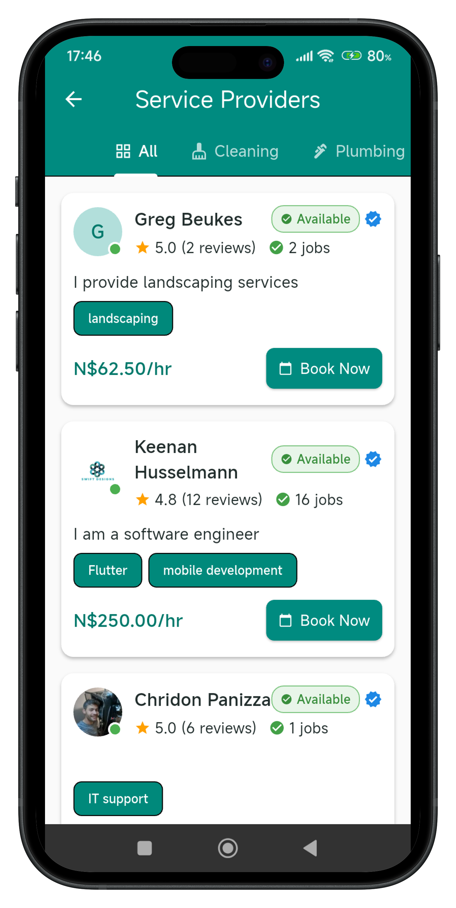
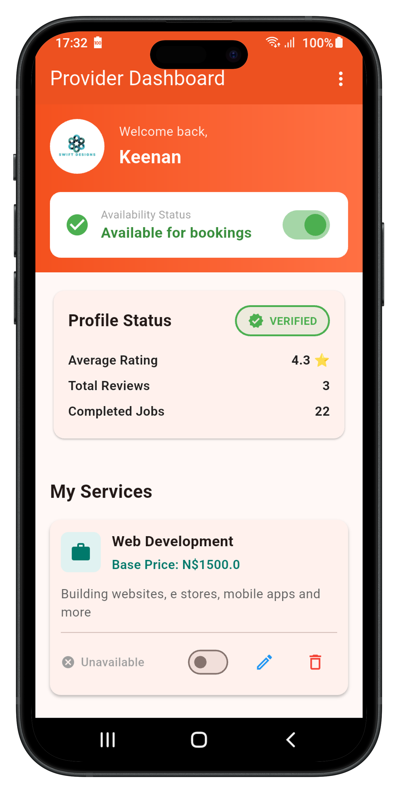

# HireMeBuddy Landing Page - Required Images

## 📸 Images You Need to Upload to `assets/` Folder

### 1. **hero-app-screenshot.png** ✅ PRIORITY
**What:** Mobile phone screenshot showing the HireMeBuddy app main screen
**Where used:** Hero section (main banner at top of page)
**Recommended content:** 
- Client app home screen showing service categories OR
- Provider feed/dashboard OR
- Search results screen with provider listings
**Size:** 400px width × 800px height (phone aspect ratio)
**Format:** PNG with transparent/white background
**Current placeholder:** Blue placeholder with "HireMeBuddy App" text

---

### 2. **provider-profile-screenshot.png** ✅ PRIORITY
**What:** Screenshot of a provider's profile page showing:
- Provider photo
- Name and rating
- Bio/description
- Service categories
- Portfolio photos
- Reviews section
**Where used:** "For Providers" section (left side)
**Size:** 600px width × 700px height
**Format:** PNG
**Current placeholder:** Green placeholder with "Provider Profile" text

---

### 3. **client-dashboard-screenshot.png** ✅ PRIORITY  
**What:** Screenshot of client's view showing:
- Search/browse interface OR
- Booking screen with date/time picker OR
- Active bookings list OR
- Chat interface with a provider
**Where used:** "For Clients" section (right side)
**Size:** 600px width × 700px height
**Format:** PNG
**Current placeholder:** Blue placeholder with "Client Dashboard" text

---

### 4. **google-play-badge.png** 📱 RECOMMENDED
**What:** Official Google Play Store badge
**Where used:** Download section
**Download from:** https://play.google.com/intl/en_us/badges/
**Size:** Official badge size (use high-res version)
**Format:** PNG with transparency

---

### 5. **app-store-badge.png** 📱 OPTIONAL (for future)
**What:** Official Apple App Store badge
**Where used:** Download section (currently disabled/grayed out)
**Download from:** https://developer.apple.com/app-store/marketing/guidelines/
**Size:** Official badge size
**Format:** PNG with transparency

---

### 6. **qr-code.png** 📱 RECOMMENDED
**What:** QR code that links to your Google Play Store app page
**Where used:** Download section below the badges
**How to create:**
1. Get your Play Store app URL
2. Go to https://www.qr-code-generator.com/
3. Enter your Play Store URL
4. Download as PNG
**Size:** 300px × 300px
**Format:** PNG

---

### 7. **og-image.png** 🌐 OPTIONAL (for social sharing)
**What:** Image shown when sharing the website on Facebook, Twitter, WhatsApp
**Content:** HireMeBuddy logo + tagline like "Book Trusted Service Providers in Namibia"
**Size:** 1200px width × 630px height (Facebook OG image standard)
**Format:** PNG or JPG
**Note:** Not displayed on the page, but improves social media appearance

---

## ✅ Already Have

- ✅ **hiremebuddy-logo.png** - Your actual logo (already uploaded)
- ✅ **logo.svg** - Placeholder logo (can be deleted if not needed)

---

## 🎨 Design Tips for Screenshots

### For Best Results:
1. **Use real app screenshots** - Not mockups or designs
2. **Show actual data** - Real provider profiles, real bookings (can blur sensitive info)
3. **Clean UI** - Make sure the interface looks polished in the screenshot
4. **Good lighting** - If photographing a phone screen, ensure no glare
5. **Consistent style** - All screenshots should have similar quality/style

### How to Take App Screenshots:
- **Android:** Press `Volume Down + Power` button simultaneously
- **Emulator:** Use the camera icon in the toolbar
- **Flutter:** Run app and use `flutter screenshot` command

### After Taking Screenshots:
1. Crop to remove status bar/navigation if desired
2. Optimize file size at https://tinypng.com/
3. Name exactly as shown above
4. Upload to `c:\Users\keena\Projects\HireMeBuddy-v1.0.0\web\landing\assets\`

---

## 📝 How to Replace Placeholders

Once you have the screenshots, update `index.html`:

**Line ~76 (Hero screenshot):**
```html
<!-- CHANGE THIS: -->


<!-- TO THIS: -->

```

**Line ~95 (Provider profile):**
```html
<!-- CHANGE THIS: -->


<!-- TO THIS: -->

```

**Line ~125 (Client dashboard):**
```html
<!-- CHANGE THIS: -->


<!-- TO THIS: -->

```

---

## 🚀 After Uploading Images

1. Test locally by opening `index.html` in browser
2. Deploy to Firebase:
   ```bash
   cd c:\Users\keena\Projects\HireMeBuddy-v1.0.0\web\landing
   firebase deploy --only hosting
   ```
3. Clear browser cache and verify at https://hiremebuddy-850a8.web.app

---

## 📊 Priority Order

**MUST HAVE (to replace placeholders):**
1. hero-app-screenshot.png
2. provider-profile-screenshot.png  
3. client-dashboard-screenshot.png

**SHOULD HAVE (for complete experience):**
4. google-play-badge.png
5. qr-code.png

**NICE TO HAVE:**
6. app-store-badge.png (for iOS launch)
7. og-image.png (for social sharing)

---

## 🎯 Summary

Upload these 3 main screenshots with these exact filenames:
- `hero-app-screenshot.png` (400×800)
- `provider-profile-screenshot.png` (600×700)
- `client-dashboard-screenshot.png` (600×700)

Then update the 3 `` lines in index.html to use `src="assets/your-filename.png"` instead.
